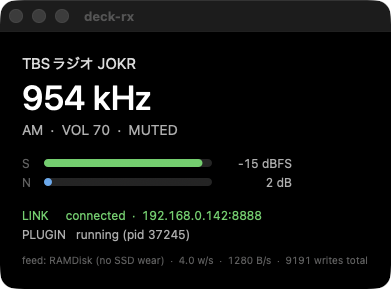

# Deck RX

Stream Deck + plugin to control a remote [SpyServer](https://airspy.com/) and listen to AM/SW/FM radio directly from the Stream Deck encoder dials.

The plugin connects over TCP to a SpyServer (e.g., an Airspy HF+ Discovery on a NanoPi), pulls down INT16 IQ samples, demodulates them in TypeScript, and feeds the resulting PCM to a chosen macOS CoreAudio device via the in-process `naudiodon` (PortAudio) sink. An optional icecast publish path (PCM → MP3 → icecast SOURCE) is also available for streaming to a remote server.


Per-dial layouts and screenshots (Tune / Volume / Combo / FM / AM / SSB / Band Select / Options Auto / Options 2-Col / FFT Display): see [docs/dial-layouts.md](docs/dial-layouts.md).

## Requirements

| | |
|---|---|
| OS | **macOS** (Apple Silicon or Intel) — CoreAudio output via `naudiodon` (PortAudio binding) |
| Host app | **Elgato Stream Deck** app v6+, with a Stream Deck **+** (the encoder + LCD model). Other Stream Deck models load the plugin but the dial / LCD actions only render usefully on the `+` |
| Runtime tooling (MacPorts) | `sudo port install portaudio` — `portaudio` (arm64) backs the `naudiodon` local-audio sink. naudiodon doubles as the PI's output-device dropdown source (its `getDevices()` / `getHostAPIs()` query CoreAudio's HAL directly, so no separate `switchaudio-osx` install is needed). Add `sudo port install ffmpeg` only if you plan to use the icecast publish path (ffmpeg hosts the MP3 encoder + icecast SOURCE client). The Stream Deck app ships its own bundled Node for running installed plugins; run `npm run rebuild-native` once after `npm install` to rebuild the naudiodon native binding against that bundled Node ABI. |
| Remote SDR | Any SpyServer-compatible receiver. Tested with **Airspy HF+ Discovery** (HF 0.5–31 MHz + VHF 60–260 MHz, 31–60 MHz hardware gap) running SpyServer on a Linux ARM/aarch64 (NanoPi etc.); see [docs/server-setup.md](docs/server-setup.md) for the server side. Airspy R2 / Mini and RTL-SDR also expected to work but are less exercised. |

Developer / contributor tooling (Node 20+, MacPorts `librsvg` / `ImageMagick` / `sox` for the dump + analysis scripts) is documented in [docs/build-install.md](docs/build-install.md). The optional companion app additionally needs `swiftc` (Xcode Command Line Tools); `rsvg-convert` renders its icon when present.

## Features

| Item | Status |
|---|---|
| Volume | ✅ (0–100 % attenuator on the leveled output; full bar = full level) |
| Master ON/OFF (Dial PUSH) | ✅ (full UI dim while OFF, persisted) |
| Connection resilience | ✅ (TCP-connect timeout, app-level watchdog for cable-pull detection, full-dial dim + `LINK` indicator + `-----` freq while offline, auto-reconnect with state restore) |
| Server host / port via PI | ✅ (debounced live-apply: changing host/port tears down + reconnects without restart) |
| FM Bandwidth | ✅ user-cycle 200 / 150 / 110 / 100 / 90 kHz (JP 100 kHz channel-spacing-aware); complex IF LPF on I/Q is a Blackman-windowed sinc FIR (linear phase, ~−74 dB stopband past cutoff). Replaced the earlier 8th-order Butterworth IIR, which only reached ~−24 dB at the narrowest cycle setting and let neighbour stations leak through the discriminator |
| AM/SW Bandwidth | ✅ (16th-order complex IF LPF on I/Q + 8th-order post-envelope LPF) |
| USB / LSB / CW | ✅ Weaver-method SSB demod (4th-order Butterworth audio LPF, ±f_off Q-flip for sideband select); CW = BFO direct-shift (default 700 Hz) + 4th-order Butterworth audio LPF at iqRate (anti-alias for the audio-rate decimation + audio band limit in one cascade). Sub-kHz display: when SSB/CW is the live demod, the 7-seg shows the floor kHz and the Hz remainder appears as a small `.XXX` next to the digit cluster |
| CW AGC | ✅ peak-follower normalisation of the BFO tone envelope. Setpoint 12000 (~37 % of Int16), max gain 5000, ~30 Hz attack / ~2 Hz decay so weak signals rise to a comfortable level without pumping during CW keying gaps. Mirrors AM Carrier AGC but with CW-specific time constants |
| Carrier AGC | ✅ (port of SDR++ `dsp::loop::AGC` + `dsp::demod::AM` CARRIER mode; tracks `\|IQ\|` with asymmetric attack/decay EWMA, applies gain to the complex IQ stream BEFORE envelope detection) |
| AGC Attack | ✅ (1–200, SDR++ slider convention = rate in 1/τ_seconds) |
| AGC Decay | ✅ (1–20) |
| AM Synchronous detection | ✅ 2nd-order PLL locks to the AM carrier (loop wn = 150 Hz, fast pull-in / minimal audio-band tracking); replaces envelope detection when AM Sync is ON; suppresses selective fading distortion. Lock gate mutes audio when the PLL loses lock; retune adds a 200 ms output mute (both VFO smooth and preset-jump) plus an 8 ms fade ramp at every mute boundary, so the PLL pull-in transient and the naudiodon-queue boundary amplitude step both stay inaudible |
| FM Stereo PLL (true phase lock) | ✅ (2nd-order Costas-style PLL locks VCO to 19 kHz pilot, loop bandwidth ≈ 50 Hz, damping = 1/√2, hysteretic lock detection so weak/intermittent pilots don't flap; STEREO badge shown only while pilot-locked AND user has stereo option enabled). 8th-order Butterworth audio LPF (4 cascaded biquads) at 15 kHz on both L+R and L−R recovery paths kills the 19 kHz pilot residue and 23-53 kHz DSB-SC subcarrier so they never reach the DAC. |
| Per-mode RF Gain (AM / FM separate) | ✅ (live-applied, debounced, pop-suppressed; on FM the dial doubles as a post-demod audio attenuator since FM is amplitude-invariant) |
| Frequency / mode persistence | ✅ debounced 500 ms write to `config.json`; on startup the stored freq + demod mode + tune step + per-mode tune step are restored before the first IQ packet. The restored freq wins over the Tune dial's connect-time preset seed (the seed runs only on a true first start, or when the stored freq isn't receivable on the connected device); the dial reconciles its preset slot onto the matching preset so the display shows the station actually playing |
| VFO step is per-mode | ✅ each demod mode (WFM / NFM / AM / USB / LSB / CW) remembers its last-used step value, so WFM 100 kHz / AM 9 kHz / SSB 100 Hz round-trip without manual re-selection |
| Preset / Step dial row | ✅ shared `Preset/Step` row: short PUSH enters edit (rotate wraps the step list), 1 s long PUSH toggles Preset ↔ VFO. Single row, two distinct controls |
| IFNR (IF Noise Reduction) | ✅ FM/NFM only (SDR++ FMIF tracking-filter port) |
| Auto station-name lookup | ✅ **Japan-area only** for the JP DB — region-switchable from the Tune dial PI across all 8 regions (関東 / 北海道 / 東北 / 東海 / 近畿 / 中国 / 九州 / 沖縄): 関東 + 沖縄 cover AM / FM / CFM together, the other 6 regions cover commercial FM via the 全国 FM 一覧 source; region-tagged manual overrides supported; the EIBI SW DB covers international shortwave (day / time / spur-aware); in-PI `Update Now` for both |
| Preset list | ✅ records come solely from the deck-rx-owned `data/presets.json` (the SDR++ `frequency_manager_config.json` mirror); the dial render-time station name is enriched from the JP DB / callsign DB for the active region but the preset *count* stays bound to the SDR++ file. PI button `Import bookmarks` re-syncs on demand (frequency-keyed dedup — re-importing collapses any pre-existing duplicate-frequency entries, preferring the JP DB CJK name); optional `Auto-sync on startup` checkbox runs the import once at every plugin launch |
| FFT Display dial | ✅ full-width 200×100 LCD encoder action showing the live IQ spectrum centered on the VFO. SDR++-style colour palette, configurable frame rate (1–120 fps) / smoothing factor / FFT size (256–2048) / dB floor & ceiling via the PI. Dial rotate = zoom on the active axis (H = horizontal span, 26 step ladder 1×–32×; V = vertical dB range, 12 step ladder 0.4×–2.0×), long-press toggles between H and V mode, short-press resets the active axis. Pixel→bin map switches between max-hold (≥1 bin/pixel, peak preserving) and linear-interp (<1 bin/pixel, smooths the comb that high zoom would otherwise produce) |
| FFT Display dial (LCDX2) | ✅ companion action that adds an LCDX1 ↔ LCDX2 mode switch — place 2 of these on adjacent dials in the same row to span one continuous spectrum across both LCDs (no inner border drawn on the seam). LCDX2 Wide doubles the visible bandwidth (clamped to the IQ rate); LCDX2 Detail keeps the bandwidth but doubles per-Hz pixel density. PI dropdown selects single / wide / detail. Mutual-pairing check — 3-in-a-row makes all three fall back to single. Short LCD tap cycles LCDX1 / Wide / Detail; long LCD tap cycles fftSize forward (256/512/1024/2048/4096/8192/16384) — IQ samples are accumulated across SpyServer chunks so the larger sizes still drive an FFT each frame. All PI settings (dB floor/ceil, fps, smoothing, fftSize, lcdMode) auto-sync between paired panels. Bottom-right corner shows current `N<size>` for confirmation |
| FFT (LCDX2) control Button | ✅ companion key action for the LCDX2 dial — drives mode / fftSize / zoom / axis from a button when the paired LCDs are full of spectrum and on-LCD operation hints are obscured. Single PI dropdown picks the operation (cycle LCD mode, cycle FFT size, zoom in / out, reset H or V zoom, toggle H↔V axis); button title reflects the current dial state via an internal event bus (`Mode\nWide`, `FFT\nN2048`, `Axis\nH`, …). Place the same action multiple times to wire several buttons, each on a different op. |
| Volume Button | ✅ companion key action for the Volume dial — Vol Up / Vol Down / Mute toggle as buttons, useful on dial-less devices (Stream Deck XL) or when dial space is taken by FFT / LCDX2. **Hold-to-repeat**: recursive `setTimeout` loop guarded by an `isPressed` flag fires the first step immediately, then continues at ~12 steps/sec until released; auto-stops on min / max. **C-curve step** (low volume = big step, high = fine, GAMMA=1.5) ports the feel of a hardware volume knob — same pattern used in the standalone `stream-deck-volume` plugin. Mute toggles once per press (no repeat). Title shows live volume `%` and an `(M)` tag while muted. |
| Audio sink | ✅ Local output via `naudiodon` (PortAudio → CoreAudio HAL); optional icecast publish path (ffmpeg + MP3 + icecast SOURCE) auto-selected from `cfg.ffmpeg.mode`. Native bindings (`naudiodon`, `deck-rx-asrc`, `segfault-handler`) need an ABI-matched rebuild against the Stream Deck app's bundled Node — run `npm run rebuild-native` once after `npm install`. See [Audio path (long-running stability)](#audio-path-long-running-stability) for the libsamplerate ASRC + drift-compensation details. |
| Output loudness leveling | ✅ Single output stage (`src/audioLeveling.ts`) applied to the final PCM before the sink, so it covers **both** the naudiodon and icecast paths. **(1)** Static per-band makeup gains (`MODE_MAKEUP`, overridable per host via `cfg.audioMakeup`, e.g. `{"1": 8}` to bring WFM down) lift each demod mode to a common loudness — WFM/NFM/SSB are raw fixed-gain, AM/CW are demod-AGC'd to different setpoints, so without this the bands jump in level and deck-rx is much quieter than other apps. This is the **default** leveller: fixed per-band gain, **no dynamic motion / no pumping**. **(2)** An adaptive output AGC is **opt-in** (`cfg.audioLeveling: true`, default off) for also tracking within-band signal-strength changes — off by default because its dynamic level-riding is audible. **(3)** A soft-knee tanh limiter is an instantaneous peak ceiling so the static gain can run hot near full-scale without hard-clip distortion (peak-only, no breathing). `cfg.audioGain` (default `1.0`, clamped `0.1..4`) is a master trim on top of the makeup; the Volume dial (0–100%) attenuates further. Independent of RF / demod gain. Unit-tested in `test/audioLeveling.test.ts`. |
| Companion app / profile auto-switch | ✅ `mac-app/` builds `/Applications/deck-rx.app`, a focusable app a Stream Deck profile can be bound to, so the deck switches to the deck-rx profile when the app comes to the front instead of being selected by hand. The same window doubles as a status readout — station name, frequency, mode, volume, S (RSSI) / N (SNR) meters, link state — fed by `src/statusFeed.ts`, which publishes only while the app is open and prefers a RAM-backed volume over disk. See [mac-app/README.md](mac-app/README.md). |

## Audio path (long-running stability)

The local-output side of deck-rx took several iterations to make rock-solid over 12 h+ sessions. The short story: two free-running crystals (the SDR host's ADC clock vs. the local CoreAudio output device's DAC clock) drift ±10 to ±100 ppm apart, and any naive fixed-rate path either lets the PortAudio queue creep into multi-second delay or starves it into click/buzz. v3 ASRC (commit `0034b51`) closed the loop.

### The drift problem

- **Writer**: SpyServer streams INT16 IQ paced by the receiver's crystal (Airspy HF+ Discovery ⇒ 768 ksps), demodulated to PCM at e.g. 114 kHz (FM) / 24 kHz (AM) by the deck-rx demod chain.
- **Reader**: macOS pulls PCM from the PortAudio buffer paced by the output device's own crystal (e.g. RME DX7s at 96 kHz native).
- Over hours these crystals walk apart. Even 10 ppm = 1 sample per 100 000 frames = ~1 s of accumulated queue drift every ~3 h at 96 kHz. Audible delay creep was already noticeable inside a single soak.

### v3 architecture (current)

```
SpyServer IQ ─ demod ─ pre-ASRC LPF ─ libsamplerate ASRC ─ naudiodon (96 kHz native) ─ CoreAudio HAL
                       (4-stage biquad,                    ratio = deviceRate/srcRate ± 1 ppm
                        kills > 22 kHz)                    closed-loop on writableLength
```

- **Device-native rate open**: `naudiodon.AudioIO` is opened at the output device's `defaultSampleRate` (e.g. 96 kHz), not at the demod's source rate. This bypasses CoreAudio's internal resampler entirely — the resampling now happens in our ASRC with a knob we control.
- **libsamplerate ASRC** (`native/samplerate`, `deck-rx-asrc` native addon): `SincFastest` quality, channels=2, ratio = `deviceRate / srcRate` baseline (e.g. 96000 / 114000 ≈ 0.8421). Implemented as a small N-API wrapper over libsamplerate so the resampler runs in-process with zero JS bridging cost per sample.
- **Closed-loop ratio control** (`src/AudioOutput.ts::updateAsrcRatio`): every N tunes, sample PortAudio's `writableLength` (bytes still in the JS Writable backlog), EMA-smooth, and nudge the ratio ±5 ppm to keep the water level inside a 6000 ± 1500 byte band. A 1 ppm "restore" pull biases the ratio back toward `baseRatio` whenever the EMA is in-band, so the loop doesn't park itself off-axis.
- **Reader-stall absorb + clean resync** (`NaudiodonOutput.write`): a CoreAudio overload — a sibling realtime client on the same output device (RME DigiCheck NG, Rogue Amoeba ARK / Audio Hijack, …) blowing its IO deadline, logged as `HALS_OverloadMessage: Overload possibly due to client timeout` — stalls our device reader for a few hundred ms. The writer keeps producing, so the JS Writable backlog spikes. Two-stage response: (1) **absorb** the backlog up to `RESYNC_HIGH` (16384×16 ≈ 680 ms) with zero drops — long enough to ride out the measured ~250–630 ms stalls, after which the queue refills and the slow ASRC loop trims it back; (2) past `RESYNC_HIGH` (stacked stalls / a pathologically long one) do **one clean resync** — skip writes until the backlog drains to `RESYNC_LOW` (16384 ≈ 43 ms), then reset the resampler + control loop and resume, so the worst case is a single short gap instead of hundreds of per-packet drops scattered over tens of seconds with the ratio railed to its floor. The icecast publish path (`FfmpegOutput.write`) keeps the simpler `OVERFLOW_DROP` guard — it drops the current PCM buffer once the ffmpeg-stdin pipe backlog exceeds 1 MiB, so a stalled icecast sink (network blip / server down) can't grow the heap without bound while ffmpeg auto-respawns.
- **Pre-ASRC LPF**: a 4-stage cascaded biquad LPF runs on the L/R PCM *before* the resampler so any residual energy above 22 kHz can't alias when the ratio < 1 produces a slightly lower output rate.

### Pop / click suppression at retune

- **200 ms output mute** around every preset jump / VFO smooth-retune (was 100 ms — extended because the AM-Sync PLL needs the longer window to pull in cleanly).
- **8 ms fade ramp** at every mute boundary so neither the PLL transient nor the naudiodon queue boundary amplitude step is audible.
- **maxQueue = 8**: 8 PortAudio buffers of cushion at the device rate. An earlier build tried 4 to shave the user-visible retune latency (leaning on the ASRC for drift), but 8 is kept — the extra device-side slack lets a brief CoreAudio reader stall ride through before the JS-side reader-stall absorb (above) has to engage. The ASRC keeps the backlog centred either way.
- **Mute relay**: the demod-side mute flag is forwarded to `AudioOutput.write(pcm, muted)` so the ratio loop knows to skip its water-level observation during the deliberately-empty period — otherwise the loop would mistake the silence for an underrun and chase it.

### What we tried first (and what broke)

| Attempt | Setting | Result over 12 h |
|---|---|---|
| v0 (fixed-rate, single rate) | naudiodon opened at srcRate, no ASRC | Multi-second delay creep, eventually audible echo |
| v1 | `maxQueue 8→4`, fade ramp, AM mute 100→200 ms | Pops fixed at retune. But ~5 s delay still crept in over 6 h |
| v2 (aggressive ratio control without device-native) | STEP `5e-5`/tune, narrow band, no LPF | Delay eliminated, then underrun after ~12 h (ratio parked at 0.992400 in the dead-zone, started starving) |
| **v3 (current)** | Device-native rate + libsamplerate ASRC + 5e-6 STEP + 1e-6 restore pull | 24 h continuous AM preset cycle (594/693/810/954/1134 kHz) + FM with no pop / no buzz / no delay creep |

### Operational traps surfaced during development

These weren't audio-path bugs per se, but they masqueraded as one for several sessions:

- **Phantom SpyServer client from a second host's Stream Deck App**: any machine with the deck-rx plugin symlink will auto-connect to the configured SpyServer the moment the Stream Deck App is foreground-launched (or stays running headlessly). That second client contends for device control. Symptom: preset rotation arrives at the dial's 7-seg display but the audio stays on the previous frequency. Fix: `ssh other-host pkill -KILL "Stream Deck"`. Any laptop / Mac mini in the household that ever had deck-rx installed is suspect.
- **Airspy HF+ has two SMA inputs**: HF 0.5–31 MHz and VHF 60–260 MHz. A misplaced antenna will make AM (or FM) completely silent with all the right diagnostics still passing on the other band. Quickest disambiguation: `airspyhf_rx -f 0.594 -m off -r /tmp/x.iq` from the SpyServer host bypasses the entire deck-rx stack in 30 s.
- **`writableLength` is bytes, not frames**: easy to misread when porting from PortAudio C examples that talk in frames. 16384 bytes at 16-bit stereo = 4096 frames = ~43 ms at 96 kHz. The thresholds in `updateAsrcRatio`, the `RESYNC_HIGH` / `RESYNC_LOW` reader-stall constants, and the icecast path's `OVERFLOW_DROP` are byte-counts on purpose, matching what `naudiodon` exposes.

### Reproducing the soak test

```sh
touch /tmp/deck-rx-audio-record         # enable the writer that drops 30 s of PCM
                                        # to /tmp/deck-rx-AM-<freq>.wav per preset
# In the Stream Deck +, cycle AM presets (594 / 693 / 810 / 954 / 1134) and let
# the receiver run continuously overnight.
ps -p $(cat /tmp/deck-rx.pid) -o etime,%cpu,rss   # process should still be < 200 MB after 24 h
sox /tmp/deck-rx-AM-594000.wav -n stat 2>&1       # rough spectral sanity check
```

## Companion app (Stream Deck profile auto-switch)



Stream Deck switches to a profile automatically when the application it is bound
to comes to the front — but a plugin is not an application, so a deck-rx profile
has nothing to bind to and must be picked by hand. `mac-app/` builds a small
companion app that fills that role, and doubles as a status window (frequency,
mode, volume, S/N meters, link state, station name) fed by `config.json`, `/tmp/deck-rx.pid`
and the live status feed in `src/statusFeed.ts`. The feed writes only while the
app is open, to `/Volumes/RAMDisk` when that RAM-backed volume is mounted and
`/tmp` otherwise — measured at 320 B per write, 3.9 writes/s, with no
measurable plugin CPU cost.

```sh
mac-app/build-app.sh          # -> /Applications/deck-rx.app
```

Then set that profile's application to `/Applications/deck-rx.app` in the Stream
Deck app. Details: [mac-app/README.md](mac-app/README.md).

## Documentation

- [Repository layout](docs/repository-layout.md)
- [Build & install](docs/build-install.md)
- [Server-side setup (SpyServer on Linux ARM/aarch64)](docs/server-setup.md)
- [Dial layouts](docs/dial-layouts.md) — per-plugin LCD screenshots + per-row UI explanations
- [Architecture notes](docs/architecture.md) — dial details, signal-path implementation, internal mechanisms
- [Station-name auto-lookup](docs/station-db.md) — JP DB scraper + EIBI integration, alias rules, NHK channel inference + transmitter-site + callsign annotation
- [Data sources & attribution](docs/data-sources.md) — Japan-only sources (総務省 MIC / 関東総通局 / 沖縄総通局) plus the international EIBI shortwave DB; license terms + refresh scripts
- [Companion app](mac-app/README.md) — `/Applications/deck-rx.app`, the focus target a Stream Deck profile binds to
- [Debug helpers](docs/debug-helpers.md) — LCD dump / lint / compare-baseline scripts

## Credits / References

The DSP algorithms and the LCD UI are inspired by / ported from two open-source projects:

- **[SDR++](https://github.com/AlexandreRouma/SDRPlusPlus)** by Alexandre Rouma — Carrier AGC (`dsp::loop::AGC` + `dsp::demod::AM` CARRIER mode), FMIF noise reduction, SpyServer protocol layout, runtime tune sequence.
- **[ATS-Mini](https://github.com/esp32-si4732/ats-mini)** by the esp32-si4732 project — segmented N (SNR) / S (RSSI) bar styling, metallic dial-knob graphic, EIBI shortwave schedule consumer.
- **Stream Deck SDK** — [@elgato/streamdeck](https://www.npmjs.com/package/@elgato/streamdeck) by Elgato.

If the upstream ATS-Mini URL has moved, please file an issue.

## License

GPL-3.0-or-later. See [LICENSE](LICENSE).

deck-rx contains ports / re-implementations of algorithms from [SDR++](https://github.com/AlexandreRouma/SDRPlusPlus) (GPL-3.0-or-later), so the project is licensed under the same terms — fork / modify / redistribute freely under GPL-3.0+.
