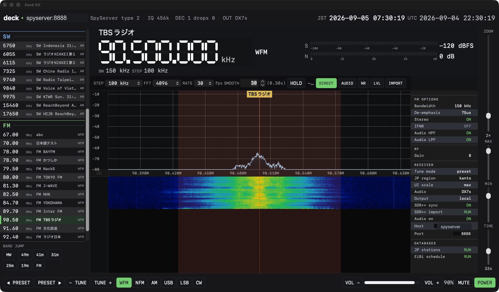

# Deck RX

A shortwave and broadcast-band receiver for a remote
[SpyServer](https://airspy.com/) — as a Stream Deck + plugin, as a Mac app, and
as an iPad app. They share the demodulators and the station databases; they
differ in what is holding the radio.

## Which one do you want

| | What it is | Needs |
| --- | --- | --- |
| **[Deck RX Solo](docs/solo.md)** — Mac app | The whole receiver in one bundle. Start here if you just want to listen. | a SpyServer on the network |
| **[Deck RX](docs/plugin.md)** — Stream Deck + plugin | Fourteen actions and the encoder dials, driving the radio from the deck. The original. | Stream Deck +, Node, macOS |
| **[Deck RX](docs/native-app.md)** — Mac front-end | A window onto the plugin's receiver. Draws what the plugin is doing; has no receiver of its own. | the plugin, on the same Mac |
| **[Deck RX](docs/ipad.md)** — iPad app | A receiver on the tablet, demodulating there. | a SpyServer on the network |

Both Mac apps are called "Deck RX" and "Deck RX Solo"; the plugin and the iPad
app are "Deck RX" too. Which is meant is usually clear from the context, and
where it is not, this page says which.

## Download

[**Deck RX Solo 1.0**](https://github.com/soresore19xx/deck-rx/releases/latest)
— signed and notarised, universal, macOS 12 or later. Drag it to Applications;
the image has an uninstaller in it. Everything else is built from source, and
so is Solo if you would rather: `native-app/build-app.sh solo`.

## What it does

Tuned by frequency or from a preset list, with station names looked up from a
Japanese database and the international EIBI schedule. AM with a carrier AGC,
narrow and wide FM (the wide one in stereo, with a real pilot PLL), USB, LSB and
CW. The spectrum and the waterfall are drawn where the ear is rather than where
the samples are, so what is seen lines up with what is heard.

Two decoders sit beside the receiver on the Mac and one of them on the iPad:
**HF weather fax** (JMH charts) and **DRM**, the shortwave digital mode. DRM is
optional and fetched separately — see [docs/solo.md](docs/solo.md).

The audio path is the part that took the longest. Two free-running crystals
drift apart by tens of parts per million, and a naive path either creeps into
seconds of delay or starves into clicks over a long session; the answer is an
adaptive resampler in a control loop. That story is in
[docs/plugin.md](docs/plugin.md), and it applies to all four.
## Documentation

The four products, each in full:

- [Deck RX Solo](docs/solo.md) — the standalone Mac receiver
- [Deck RX plugin](docs/plugin.md) — the Stream Deck + plugin
- [Deck RX front-end](docs/native-app.md) — the Mac window onto the plugin
- [Deck RX for iPadOS](docs/ipad.md)

And the rest:

- [Repository layout](docs/repository-layout.md)
- [Build & install](docs/build-install.md)
- [Server-side setup (SpyServer on Linux ARM/aarch64)](docs/server-setup.md)
- [Dial layouts](docs/dial-layouts.md) — per-plugin LCD screenshots + per-row UI explanations
- [Architecture notes](docs/architecture.md) — dial details, signal-path implementation, internal mechanisms
- [Station-name auto-lookup](docs/station-db.md) — JP DB scraper + EIBI integration, alias rules, NHK channel inference + transmitter-site + callsign annotation
- [Data sources & attribution](docs/data-sources.md) — Japan-only sources (総務省 MIC / 関東総通局 / 沖縄総通局) plus the international EIBI shortwave DB; license terms + refresh scripts
- [Standalone app port](docs/standalone-app-port.md) — what moved to Swift, what the system frameworks replaced, and why the plugin keeps its own signal path
- [Debug helpers](docs/debug-helpers.md) — LCD dump / lint / compare-baseline scripts

## Credits / References

The DSP algorithms and the LCD UI are inspired by / ported from two open-source projects:

- **[SDR++](https://github.com/AlexandreRouma/SDRPlusPlus)** by Alexandre Rouma — Carrier AGC (`dsp::loop::AGC` + `dsp::demod::AM` CARRIER mode), FMIF noise reduction, SpyServer protocol layout, runtime tune sequence.
- **[ATS-Mini](https://github.com/esp32-si4732/ats-mini)** by the esp32-si4732 project — segmented N (SNR) / S (RSSI) bar styling, metallic dial-knob graphic, EIBI shortwave schedule consumer.
- **Stream Deck SDK** — [@elgato/streamdeck](https://www.npmjs.com/package/@elgato/streamdeck) by Elgato.
- **[drm-receiver](https://github.com/JvanKatwijk/drm-receiver)** by Jan van Katwijk — the DRM decoder Solo links, with Qt taken out of it. Fetched and patched by `native-app/drm/fetch.sh`; nothing of it is checked in here.

If the upstream ATS-Mini URL has moved, please file an issue.

## License

GPL-3.0-or-later. See [LICENSE](LICENSE).

deck-rx contains ports / re-implementations of algorithms from [SDR++](https://github.com/AlexandreRouma/SDRPlusPlus) (GPL-3.0-or-later), so the project is licensed under the same terms — fork / modify / redistribute freely under GPL-3.0+.

The optional DRM decoder is [drm-receiver](https://github.com/JvanKatwijk/drm-receiver), GPL-2.0-or-later, which the "or later" makes compatible with this. Its audio needs **fdk-aac**, whose Fraunhofer licence grants no patent rights and therefore does not combine with the GPL in a distributed binary — the same reason ffmpeg calls a `--enable-gpl --enable-nonfree` build unredistributable. Publishing source is unaffected and is all this repository does, but **a binary built with DRM enabled must not be passed on**. Building and running one yourself triggers no obligation at all.
