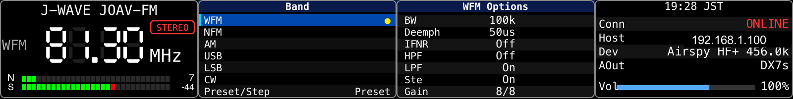

# Deck RX

Stream Deck + plugin to control a remote [SpyServer](https://airspy.com/) and listen to AM/SW/FM radio directly from the Stream Deck encoder dials.

The plugin connects over TCP to a SpyServer (e.g., an Airspy HF+ Discovery on a NanoPi), pulls down INT16 IQ samples, demodulates them in TypeScript, and pipes the resulting PCM through `ffmpeg` to a chosen macOS CoreAudio device.

Per-dial layouts and screenshots (Tune / Volume / Combo / FM / AM / SSB / Band Select / Options Auto / Options 2-Col / FFT Display): see [docs/dial-layouts.md](docs/dial-layouts.md).

## Requirements

| | |
|---|---|
| OS | **macOS** (Apple Silicon or Intel) — CoreAudio output via ffmpeg's audiotoolbox device path |
| Host app | **Elgato Stream Deck** app v6+, with a Stream Deck **+** (the encoder + LCD model). Other Stream Deck models load the plugin but the dial / LCD actions only render usefully on the `+` |
| Runtime tooling (MacPorts) | `sudo port install ffmpeg switchaudio-osx portaudio` — `ffmpeg` is the default demod → audio bridge (option `ffmpeg7` also supported via the PI), `switchaudio-osx` resolves output device names, `portaudio` (arm64) is needed when the user picks the alternative `naudiodon` audio engine. The Stream Deck app ships its own bundled Node for running installed plugins; run `npm run rebuild-native` once after `npm install` to rebuild the naudiodon native binding against that bundled Node ABI. |
| Remote SDR | Any SpyServer-compatible receiver. Tested with **Airspy HF+ Discovery** (HF 0.5–31 MHz + VHF 60–260 MHz, 31–60 MHz hardware gap) running SpyServer on a Linux ARM/aarch64 (NanoPi etc.); see [docs/server-setup.md](docs/server-setup.md) for the server side. Airspy R2 / Mini and RTL-SDR also expected to work but are less exercised. |

Developer / contributor tooling (Node 20+, MacPorts `librsvg` / `ImageMagick` / `sox` for the dump + analysis scripts) is documented in [docs/build-install.md](docs/build-install.md).

## Features

| Item | Status |
|---|---|
| Volume | ✅ (0–150 %, bar shows overdrive zone past 100 % unity mark) |
| Master ON/OFF (Dial PUSH) | ✅ (full UI dim while OFF, persisted) |
| Connection resilience | ✅ (TCP-connect timeout, app-level watchdog for cable-pull detection, full-dial dim + `LINK` indicator + `-----` freq while offline, auto-reconnect with state restore) |
| Server host / port via PI | ✅ (debounced live-apply: changing host/port tears down + reconnects without restart) |
| FM Bandwidth | ✅ user-cycle 200 / 150 / 110 / 100 / 90 kHz (JP 100 kHz channel-spacing-aware); 8th-order Butterworth FIR (Blackman-windowed sinc) complex IF LPF on I/Q |
| AM/SW Bandwidth | ✅ (16th-order complex IF LPF on I/Q + 8th-order post-envelope LPF) |
| USB / LSB / CW | ✅ Weaver-method SSB demod (4th-order Butterworth audio LPF, ±f_off Q-flip for sideband select); CW = BFO direct-shift (default 700 Hz) + 4th-order Butterworth audio LPF at iqRate (anti-alias for the audio-rate decimation + audio band limit in one cascade). Sub-kHz display: when SSB/CW is the live demod, the 7-seg shows the floor kHz and the Hz remainder appears as a small `.XXX` next to the digit cluster |
| CW AGC | ✅ peak-follower normalisation of the BFO tone envelope. Setpoint 12000 (~37 % of Int16), max gain 5000, ~30 Hz attack / ~2 Hz decay so weak signals rise to a comfortable level without pumping during CW keying gaps. Mirrors AM Carrier AGC but with CW-specific time constants |
| Carrier AGC | ✅ (port of SDR++ `dsp::loop::AGC` + `dsp::demod::AM` CARRIER mode; tracks `\|IQ\|` with asymmetric attack/decay EWMA, applies gain to the complex IQ stream BEFORE envelope detection) |
| AGC Attack | ✅ (1–200, SDR++ slider convention = rate in 1/τ_seconds) |
| AGC Decay | ✅ (1–20) |
| AM Synchronous detection | ✅ 2nd-order PLL locks to the AM carrier (loop wn = 150 Hz, fast pull-in / minimal audio-band tracking); replaces envelope detection when AM Sync is ON; suppresses selective fading distortion. Lock gate mutes audio when the PLL loses lock; VFO retune adds a 200 ms output mute so the pull-in transient stays inaudible |
| FM Stereo PLL (true phase lock) | ✅ (2nd-order Costas-style PLL locks VCO to 19 kHz pilot, loop bandwidth ≈ 50 Hz, damping = 1/√2, hysteretic lock detection so weak/intermittent pilots don't flap; STEREO badge shown only while pilot-locked AND user has stereo option enabled). 8th-order Butterworth audio LPF (4 cascaded biquads) at 15 kHz on both L+R and L−R recovery paths kills the 19 kHz pilot residue and 23-53 kHz DSB-SC subcarrier so they never reach the DAC. |
| Per-mode RF Gain (AM / FM separate) | ✅ (live-applied, debounced, pop-suppressed; on FM the dial doubles as a post-demod audio attenuator since FM is amplitude-invariant) |
| Frequency / mode persistence | ✅ debounced 500 ms write to `config.json`; on startup the stored freq + demod mode + tune step + per-mode tune step are restored before the first IQ packet |
| VFO step is per-mode | ✅ each demod mode (WFM / NFM / AM / USB / LSB / CW) remembers its last-used step value, so WFM 100 kHz / AM 9 kHz / SSB 100 Hz round-trip without manual re-selection |
| Preset / Step dial row | ✅ shared `Preset/Step` row: short PUSH enters edit (rotate wraps the step list), 1 s long PUSH toggles Preset ↔ VFO. Single row, two distinct controls |
| IFNR (IF Noise Reduction) | ✅ FM/NFM only (SDR++ FMIF tracking-filter port) |
| Auto station-name lookup | ✅ **Japan-area only** for the JP DB — region-switchable from the Tune dial PI across all 8 regions (関東 / 北海道 / 東北 / 東海 / 近畿 / 中国 / 九州 / 沖縄): 関東 + 沖縄 cover AM / FM / CFM together, the other 6 regions cover commercial FM via the 全国 FM 一覧 source; region-tagged manual overrides supported; the EIBI SW DB covers international shortwave (day / time / spur-aware); in-PI `Update Now` for both |
| Preset list | ✅ records come solely from the deck-rx-owned `data/presets.json` (the SDR++ `frequency_manager_config.json` mirror); the dial render-time station name is enriched from the JP DB / callsign DB for the active region but the preset *count* stays bound to the SDR++ file. PI button `Import bookmarks` re-syncs on demand (frequency-keyed dedup — re-importing collapses any pre-existing duplicate-frequency entries, preferring the JP DB CJK name); optional `Auto-sync on startup` checkbox runs the import once at every plugin launch |
| FFT Display dial | ✅ full-width 200×100 LCD encoder action showing the live IQ spectrum centered on the VFO. SDR++-style colour palette, configurable frame rate (1–120 fps) / smoothing factor / FFT size (256–2048) / dB floor & ceiling via the PI. Dial rotate = zoom on the active axis (H = horizontal span, 26 step ladder 1×–32×; V = vertical dB range, 12 step ladder 0.4×–2.0×), long-press toggles between H and V mode, short-press resets the active axis. Pixel→bin map switches between max-hold (≥1 bin/pixel, peak preserving) and linear-interp (<1 bin/pixel, smooths the comb that high zoom would otherwise produce) |
| Audio engine selector | ✅ Tune dial PI dropdown picks between `ffmpeg → audiotoolbox` (battle-tested, free resample + format conversion, but the audiotoolbox sink wedges every ~5 h of continuous playback) and in-process `naudiodon` (PortAudio binding straight to CoreAudio, no wedge, slightly different volume + needs an ABI-matched native rebuild against the Stream Deck app's bundled Node — see `npm run rebuild-native`). PI also lets the user pin a specific ffmpeg binary path (auto / 4.x / 7.x) so users with both MacPorts builds installed can compare |

## Documentation

- [Repository layout](docs/repository-layout.md)
- [Build & install](docs/build-install.md)
- [Server-side setup (SpyServer on Linux ARM/aarch64)](docs/server-setup.md)
- [Dial layouts](docs/dial-layouts.md) — per-plugin LCD screenshots + per-row UI explanations
- [Architecture notes](docs/architecture.md) — dial details, signal-path implementation, internal mechanisms
- [Station-name auto-lookup](docs/station-db.md) — JP DB scraper + EIBI integration, alias rules, NHK channel inference + transmitter-site + callsign annotation
- [Data sources & attribution](docs/data-sources.md) — Japan-only sources (総務省 MIC / 関東総通局 / 沖縄総通局) plus the international EIBI shortwave DB; license terms + refresh scripts
- [Debug helpers](docs/debug-helpers.md) — LCD dump / lint / compare-baseline scripts

## Credits / References

The DSP algorithms and the LCD UI are inspired by / ported from two open-source projects:

- **[SDR++](https://github.com/AlexandreRouma/SDRPlusPlus)** by Alexandre Rouma — Carrier AGC (`dsp::loop::AGC` + `dsp::demod::AM` CARRIER mode), FMIF noise reduction, SpyServer protocol layout, runtime tune sequence.
- **[ATS-Mini](https://github.com/esp32-si4732/ats-mini)** by the esp32-si4732 project — segmented N (SNR) / S (RSSI) bar styling, metallic dial-knob graphic, EIBI shortwave schedule consumer.
- **Stream Deck SDK** — [@elgato/streamdeck](https://www.npmjs.com/package/@elgato/streamdeck) by Elgato.

If the upstream ATS-Mini URL has moved, please file an issue.

## License

GPL-3.0-or-later. See [LICENSE](LICENSE).

deck-rx contains ports / re-implementations of algorithms from [SDR++](https://github.com/AlexandreRouma/SDRPlusPlus) (GPL-3.0-or-later), so the project is licensed under the same terms — fork / modify / redistribute freely under GPL-3.0+.
