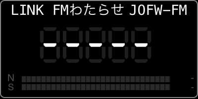

# Dial layouts

Each registered Stream Deck action — encoder dials and the one keypad button — and what it shows.

## Deck RX Tune (keypad button)

One-shot preset-tune button. Configure a preset slot (1-N) in the PI; pressing the key sends `setDemodMode` + `setFrequency` to spyService and flashes an OK badge. The button's title shows the slot's station name (or the preset's auto-resolved JP DB / EIBI label) so a row of these buttons becomes a directly-tappable preset rack alongside the dials. Refuses the tune (showAlert) when the slot's freq isn't receivable on the connected SDR (e.g. an HF+ user has a 50 MHz slot in the 31–60 MHz hardware gap).

## Deck RX Dial (Tune)

VFO / preset scrolling, 7-seg frequency, FM stereo lock badge, ATS-Mini-style N (SNR) / S (RSSI) bars, `HH:MM TZ` clock; long-press (≥ 2 s) for master ON/OFF. Header carries the JP DB-resolved station name + 識別信号 callsign + 送信地 (e.g. `NHK第1 JOAK (東京)`).

## Deck RX Volume + Status

0–150 % volume / mute, conn state, host, device, audio output, icecast publish health. Title bar carries the `HH:MM TZ` clock so the Tune dial's freq area is left to the 7-seg.

## Deck RX Combo Options

Unified Band selector (WFM / NFM / AM / USB / LSB / CW) on the left column + mode-dependent Options on the right column. PUSH on a Band row immediately switches the demod mode (no edit-mode roundtrip); the Opts column auto-shapes to AM (BW / CAGC / Sync / Atk / Dec / Gain), FM (Deemph / IFNR / HPF / LPF / Ste / Gain), or SSB (BW / BFO / Gain) depending on the active demod. Mode/Step (preset ⇄ vfo + step cycle) lives at the bottom of the Band column.

The Tune dial follows the Band PUSH automatically: it jumps to the first matching-mode preset that's actually receivable on the connected SDR; for SSB / CW where presets typically don't exist, it falls back to a band-representative default (USB → 14.200 MHz, LSB → 7.100 MHz, CW → 7.025 MHz, NFM → 145.000 MHz), so a Band PUSH always moves the dial to a sensible freq even in VFO mode. Returning to AM/WFM finds a matching preset and restores attribution.

## Deck RX Options (FM/NFM)

Deemphasis / IFNR / HPF / LPF / Stereo / Gain. Auto-dims and shows `(<live mode> live)` title hint + locks out edits when the active demod isn't FM-family.

## Deck RX AM Options

BW / Carrier AGC / Sync / Attack / Decay / Gain. Auto-dims and shows `(<live mode> live)` (e.g. `AM Options (USB live)`) + locks out edits when active demod isn't AM (symmetric to FM Options above).

## Deck RX SSB Options

BW (250 Hz – 2.8 kHz CW + voice) / BFO (CW pitch 400–900 Hz) / Mode / Gain. Active only while USB / LSB / CW is the live demod.

## Deck RX Band Select

Full-width Band column variant of the Combo dial without the Opts side. Useful when a user pairs it with a separate Options dial of their choice.

## Deck RX Options Auto

Single-column, auto-shaping Options panel (`<MODE> Options` title). Shows the row set for whatever the active demod is (AM / FM / SSB), no Band column.

## Deck RX Options 2-Col

Two-column comparison view: AM rows on the left, FM rows on the right. The active demod's column is bright; the inactive column shows live values dimmed for at-a-glance contrast.

---

See [architecture.md](architecture.md) for layout details, focus highlight colours, and signal-path notes.
