# Dial & button layouts

Each registered Stream Deck action — encoder dials, the existing keypad button, and the new companion key actions — and what it shows.

## Offline / disconnected state

When the SpyServer connection drops (cable pull, server reboot, master OFF), every dial dims and signals `LINK` / `OFFLINE`. The Tune dial swaps its 7-seg digits for dashes and prefixes the header with `LINK` (last station name kept so the user can see what they were on); Status panel switches `Conn` to red `OFFLINE`; meters drop to zero / `-`. State cache (Host, Dev, AOut, last freq + mode) is preserved so the reconnect is seamless — the plugin auto-reconnects, all values snap back.

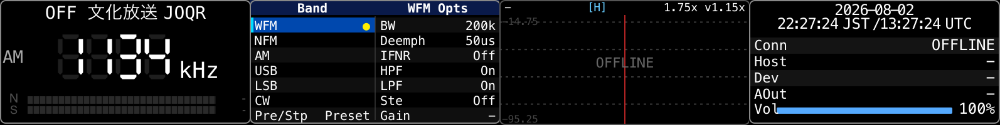

## Deck RX Tune (keypad button)

One-shot preset-tune button. Configure a preset slot (1-N) in the PI; pressing the key sends `setDemodMode` + `setFrequency` to spyService and flashes an OK badge. The button's title shows the slot's station name (or the preset's auto-resolved JP DB / EIBI label) so a row of these buttons becomes a directly-tappable preset rack alongside the dials. Refuses the tune (showAlert) when the slot's freq isn't receivable on the connected SDR (e.g. an HF+ user has a 50 MHz slot in the 31–60 MHz hardware gap).

## Deck RX Dial (Tune)

VFO / preset scrolling, 7-seg frequency, FM stereo lock badge, ATS-Mini-style N (SNR) / S (RSSI) bars, `HH:MM TZ` clock; long-press (≥ 2 s) for master ON/OFF. Header carries the JP DB-resolved station name + 識別信号 callsign + 送信地 (e.g. `NHK第1 JOAK (東京)`). See the Tune dial in the top composite (`lcd-combined.png`) — a synthetic single-dial render isn't shown here because the harness has no SpyServer connect, so the body never tunes a freq.

## Deck RX Volume + Status

0–150 % volume / mute, conn state, host, device, audio output, icecast publish health. Title bar carries the `HH:MM TZ` clock so the Tune dial's freq area is left to the 7-seg.

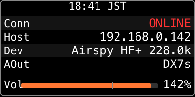

## Deck RX Combo Options

Unified Band selector (WFM / NFM / AM / USB / LSB / CW) on the left column + mode-dependent Options on the right column. PUSH on a Band row immediately switches the demod mode (no edit-mode roundtrip); the Opts column auto-shapes to AM (BW / CAGC / Sync / Atk / Dec / Gain), FM (Deemph / IFNR / HPF / LPF / Ste / Gain), or SSB (BW / BFO / Gain) depending on the active demod. Mode/Step (preset ⇄ vfo + step cycle) lives at the bottom of the Band column.

The Tune dial follows the Band PUSH automatically: it jumps to the first matching-mode preset that's actually receivable on the connected SDR; for SSB / CW where presets typically don't exist, it falls back to a band-representative default (USB → 14.200 MHz, LSB → 7.100 MHz, CW → 7.025 MHz, NFM → 145.000 MHz), so a Band PUSH always moves the dial to a sensible freq even in VFO mode. Returning to AM/WFM finds a matching preset and restores attribution.

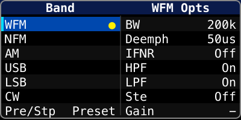

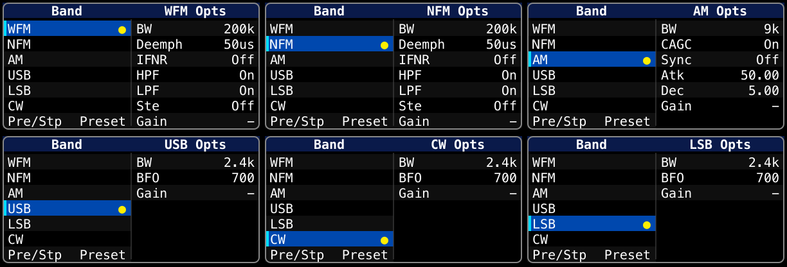

## Deck RX Options (FM/NFM)

Deemphasis / IFNR / HPF / LPF / Stereo / Gain. Auto-dims and shows `(<live mode> live)` title hint + locks out edits when the active demod isn't FM-family.

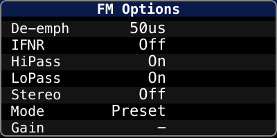

## Deck RX AM Options

BW / Carrier AGC / Sync / Attack / Decay / Gain. Auto-dims and shows `(<live mode> live)` (e.g. `AM Options (USB live)`) + locks out edits when active demod isn't AM (symmetric to FM Options above).

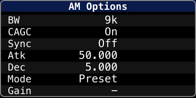

## Deck RX SSB Options

BW (250 Hz – 2.8 kHz CW + voice) / BFO (CW pitch 400–900 Hz) / Mode / Gain. Active only while USB / LSB / CW is the live demod.

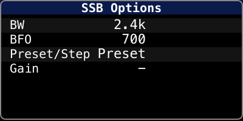

## Deck RX Band Select

Full-width Band column variant of the Combo dial without the Opts side. Useful when a user pairs it with a separate Options dial of their choice.

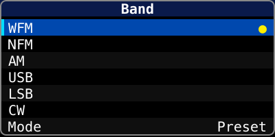

## Deck RX Options Auto

Single-column, auto-shaping Options panel (`<MODE> Options` title). Shows the row set for whatever the active demod is (AM / FM / SSB), no Band column.

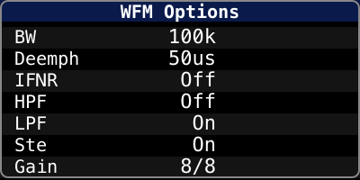

## Deck RX Options 2-Col

Two-column comparison view: AM rows on the left, FM rows on the right. The active demod's column is bright; the inactive column shows live values dimmed for at-a-glance contrast.

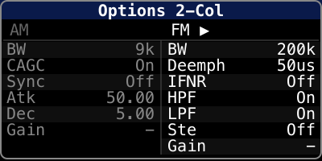

## Deck RX FFT Display

Full-width 200×100 real-time IQ spectrum centred on the current VFO. Cyan-tinted SDR++-style fill + outline; red crosshair marks DC (= VFO freq); dashed grid every 20 dB; dB floor / ceiling tick labels on the side. Header carries the center freq (left) and the displayed span (right) with the current zoom multiplier (e.g. `±28.5 kHz 4x`) plus an axis-mode badge (`[H]` = horizontal zoom in cyan, `[V]` = vertical dB-range zoom in orange) so the user always knows which axis the dial is currently driving.

Controls:
- **Rotate** — zoom on the active axis. H ladder (1× → 32×, 26 steps, fine near 1× / coarse past 8×); V ladder (0.4× → 2.0× of the PI-configured dB range around its midpoint, 12 steps).
- **Short PUSH** — reset the active axis to its default (1× for H, 1.0× for V).
- **Long PUSH (≥ 600 ms)** — toggle between H ↔ V axis modes.

PI parameters: FFT frame rate (1–120 fps, default 16), smoothing factor (1–64, SDR++ convention α = 1/value, default 16), FFT size (256 / 512 / 1024 / 2048, default 512), dB floor (default -110), dB ceiling (default -20).

Pixel → bin map switches automatically between max-hold (when ≥ 1 bin/pixel, preserves peaks) and linear interpolation (when < 1 bin/pixel at high zoom, smooths the comb pattern that naive nearest-neighbour mapping would otherwise produce).

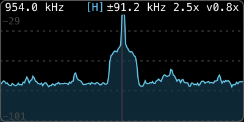

Live capture above: TBS Radio (954 kHz) with H mode at 2.5× zoom (±91.2 kHz span) and V at 0.8× of the PI-configured dB range. The strong carrier peak sits exactly on the red VFO crosshair; weaker adjacent-station sidelobes spread to either side. Same dial in V mode would show the orange `[V]` badge instead.

## Deck RX FFT Display (LCDX2)

Companion to the single-LCD FFT dial. Same rendering engine but with an LCDX1 ↔ LCDX2 mode switch that lets the user pair two adjacent dials (same row, columns ±1, both set to the same LCDX2 sub-mode) and span one continuous spectrum across both LCDs. The seam-side LCD frame is omitted on paired panels so the two LCDs read as one wide screen.

Modes (PI dropdown or LCD short-tap cycle):
- **LCDX1 (single)** — identical to the standalone FFT dial (1× iqRate / zoom across 200 px).
- **LCDX2 Wide** — total span = `min(viewBandwidth × 2, wholeBandwidth)`, split half-and-half across the pair. Per-Hz pixel density matches LCDX1; the user sees 2× more spectrum.
- **LCDX2 Detail** — total span = `viewBandwidth` (unchanged), split half-and-half across the pair. Per-Hz pixel density doubled.

Pairing rules:
- Both dials in the pair must carry the same LCDX2 sub-mode for the pair to form.
- Pairing is **mutual** — if your neighbour also has another adjacent same-mode neighbour (3 in a row), nobody pairs; everyone falls back to single. Remove one to recover.
- When unpaired, the panel renders LCDX1-style with a `[?]` mode-tag in the header so the user knows the pair didn't form.

Controls beyond the base FFT dial:
- **Short LCD tap** — cycle LCDX1 → LCDX2 Wide → LCDX2 Detail → LCDX1 (changes propagate to the paired sibling).
- **Long LCD tap** — cycle FFT size forward (256 → 512 → 1024 → 2048 → 4096 → 8192 → 16384 → wrap). IQ samples are accumulated across SpyServer chunks so 8 k / 16 k sizes still drive one FFT per render.
- All other rotate / push / long-press semantics are identical to the base FFT dial.

Settings auto-sync between paired panels (dB floor & ceiling, fps, smoothing, fftSize, lcdMode, plus the dial-side zoom / vZoom / axis). Edit either side and the other follows; the loop is broken by a no-op diff check on the echo.

Header layout:
- `single` — center freq (left) + `[H]`/`[V]` axis badge + span / zoom (right).
- `left` — center freq + mode tag (`W` for Wide, `D` for Detail) only.
- `right` — `[H]`/`[V]` axis badge + span / zoom only.
- Bottom-right of every panel: `N<size>` shows the current FFT size.

VFO crosshair is the red 1-px line; in `single` it sits at the panel centre, in `left` at the right edge, in `right` at the left edge — together the two halves form a continuous mark at the pair's centre frequency.

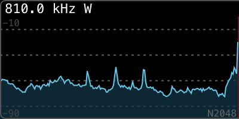
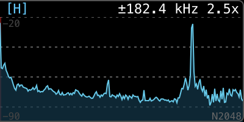

Captures above: LCDX2 Wide pair tuned to 810.0 kHz (AM band), zoom 2.5×. The left panel carries the centre freq + `W` mode tag; the right panel carries the `[H]` axis badge + total span `±182.4 kHz` + `2.5x` zoom multiplier + the `N2048` FFT-size indicator. The VFO crosshair (faint red) at each panel's seam edge joins into one continuous mark across the boundary; the outer rounded frame is suppressed on the seam side so the two LCDs read as one wide panel.

## Deck RX FFT (LCDX2) Control Button

Companion **key action** for the LCDX2 FFT dial. LCDX2 mode hands both LCDs over to the spectrum, so on-LCD operation hints (axis badge, span text, mode tag) get crowded into a single shared header — and dial-side gestures (rotate, push, touch) are the only way to drive mode / size / zoom. This button takes the most-used operations back out to a free keypad slot so a user can A/B-compare modes or jump fftSize from across the deck.

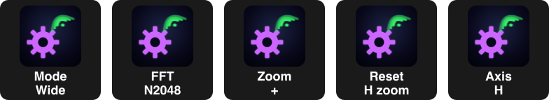

The PI carries a single dropdown that picks **what this button does**; place the action multiple times to wire several buttons each on a different op.

| PI Operation | Title format (live) | Effect when pressed |
|---|---|---|
| Cycle LCD mode | `Mode` / `LCDX1` \| `Wide` \| `Detail` | Cycle every placed LCDX2 dial through single → Wide → Detail → single. Pair (dis)formation propagates automatically. |
| Cycle FFT size | `FFT` / `N256` … `N16384` | Cycle every dial through 256 / 512 / 1024 / 2048 / 4096 / 8192 / 16384, then wrap. Same accumulator path as the dial-side long-touch cycle. |
| Zoom in | `Zoom` / `+` | Advance the active axis (H or V) by one step on every dial. |
| Zoom out | `Zoom` / `−` | Recede the active axis by one step. |
| Reset H zoom | `Reset` / `H zoom` | H zoom → 1× on every dial. |
| Reset V zoom | `Reset` / `V zoom` | V zoom → 1.0× of the PI-configured dB range on every dial. |
| Toggle H/V axis | `Axis` / `H` \| `V` | Flip active axis on every dial. |

Title state updates live via an in-plugin `EventEmitter` (`fftLcdx2Bus`) that the dial publishes to after every state mutation — so the title always reflects the dial's actual current value with no polling. When no LCDX2 dial is placed, the action is a no-op; titles show `—` placeholders.

## Deck RX Volume Button

Companion **key action** for the existing Volume dial. Useful on dial-less devices (Stream Deck XL) or when the dial space on the + is fully consumed by FFT / LCDX2 panels.

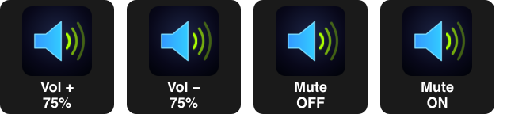

| PI Operation | Title format (live) | Effect when pressed |
|---|---|---|
| Volume up | `Vol +` / `75%` (or `75% (M)` while muted) | Increase volume; auto-repeats while held (~12 steps/sec). |
| Volume down | `Vol −` / `75%` (or `75% (M)`) | Decrease volume; auto-repeats while held. |
| Mute toggle | `Mute` / `OFF` ↔ `ON` | Toggle mute once per press. No repeat. |

**Hold-to-repeat** is a recursive `setTimeout` loop guarded by an `isPressed` flag — first step on key-down fires immediately, repeats at ~80 ms intervals while held, stops on the next iteration when key-up arrives. Auto-terminates when volume reaches 0 % or 150 % so it does not keep firing no-ops at the rail.

**Step size follows a C-curve** (low volume → large jumps, high volume → fine adjustments). At 0–10 % each press bumps ~8 percentage points so you can ramp out of silence in a couple of taps; at 90 %+ the step shrinks toward 1 % for fine control. Constants: `MIN_STEP=1%`, `MAX_STEP=8%`, `GAMMA=1.5`, ratio = `(1 − v)^γ`. Pattern + constants ported from the standalone `stream-deck-volume` plugin.

The title reflects live state via `spyService.subscribeVolume`, so external volume changes (dial, other clients, OS) update the button title within one event tick. A `(M)` suffix on Vol +/− titles indicates muted state without needing a separate Mute button on the same page.

---

See [architecture.md](architecture.md) for layout details, focus highlight colours, and signal-path notes.
