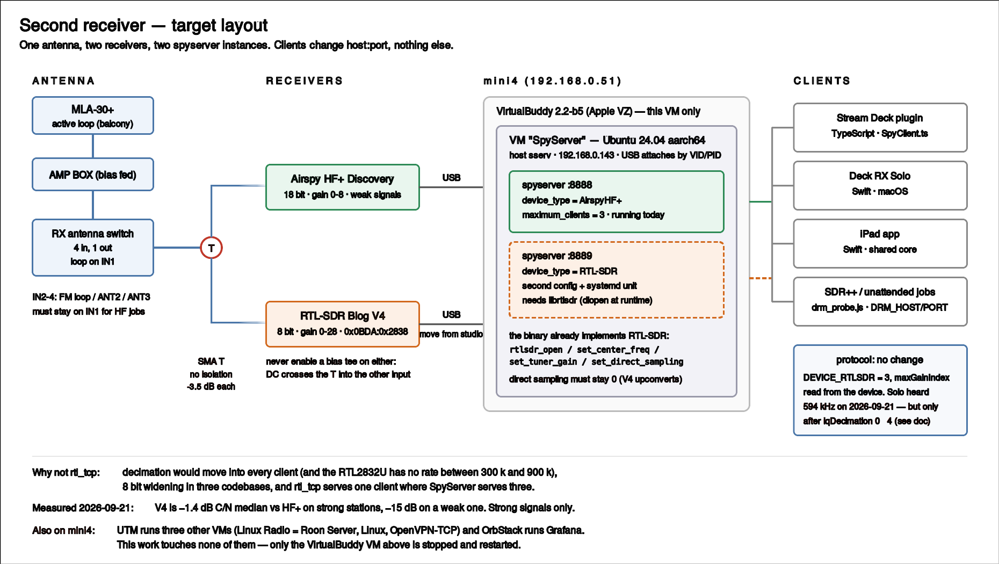

# A second receiver — design notes

How to let the RTL-SDR Blog V4 be heard from Deck RX Solo, the Stream Deck
plugin and the iPad app, alongside the Airspy HF+ Discovery.

Part of [deck-rx](../README.md).

**Status, 2026-09-21: built.** What the sections below leave as an open design
question — settings that mean different things on different front ends — shipped
as one resolver, ported rule for rule into both languages
(`src/deviceSettings.ts`, `native-app/Sources/DeviceSettings.swift`), with a
`devices` map in each config keyed by device type and serial. `deviceBands.ts`
now prefers the range the server reports over its hardcoded RTL-SDR table. The
rules are pinned by `test/deviceSettings.test.ts` and
`native-app/Tests/DeviceSettingsTests.swift`; the rest of this file is kept as
the reasoning that got there.

**Verified on the deck the same evening**, and worth knowing before touching the
map: a profile is filed by merging it into the config as it sits on disk, never
by writing this process's whole config back. The first version did the latter,
and switching V4 → HF+ deleted the V4's entry — the resolver was right and the
file I/O around it was not, which is why no resolver test caught it. The plugin
also has to carry `devices` through `loadConfig()`; that function rebuilds the
config field by field, so anything it forgets is dropped on every start.

Solo had the same shape of fault from the other direction: two places built a
`DeviceProfile` and one of them filled three of the four fields, so the
`audioDecimate` that `adopt` filed was overwritten with nothing on the next
settings change. There is one builder now, `RadioConfig.profileInForce()`.
Both faults were found by switching receivers on the hardware and looking at
the file — neither is reachable from a resolver test.

**Gain on an 8 bit front end belongs to the band, not to the demod mode.**
deck-rx files one gain per mode (`amGain`, `fmGain`), which is fine for a
receiver with headroom and wrong for this one: SSB on mediumwave then reaches
for whatever was last used on shortwave. Measured on the V4 through the same
antenna, index 0 against index 5 — the 594 kHz carrier fell from 51 to 32 dB
over the floor, the noise floor at 1100 kHz rose 39 dB, the stations visible
around 750 kHz went from 11 to 3, and the band filled with narrow peaks off the
9 kHz raster. So for RTL devices the resolver picks its default by frequency
(index 1, about 0.9 dB, below 2 MHz; index 17, about 32.8 dB, above it) and
also caps a stored value on mediumwave. Other receivers are untouched.

## What the V4 is for

Measured against the HF+ on the same antenna on 2026-09-21 (mediumwave, three
centres, two rounds, the frame used by every sweep in this repo's history):

| | V4 (gain 0.9) | HF+ (gain 5) |
|---|---|---|
| C/N, 11 stations, median | **-1.4 dB** | reference |
| strong locals 594 / 810 / 954 / 1134 | -0.4 / -0.9 / -2.0 / -3.6 dB | reference |
| **weak station 882** (C/N 29 dB on the HF+) | **-15.0 dB** | reference |
| round-to-round spread | 0.42 dB median | 0.90 dB |
| floor curve | flat within ±1 dB | ±6 dB of structure |
| frequency error | -11.1 Hz at 594 kHz | +0.067 ppm |

The V4 keeps up on strong signals and falls apart on weak ones. Its floor being
*flat* is the tell: the same antenna shows the HF+ ±6 dB of real structure, so
the V4 is listening to itself, not to the band. That is the 8 bit converter —
mediumwave saturates it unless the gain sits at the bottom of the list, and at
the bottom of the list the noise floor rises. There is no setting that escapes
both.

So: **the V4 is for listening to strong signals** — AM broadcast, the major
shortwave outlets, FM. It is not a second machine for hunting DRM blocks, which
is exactly the weak-signal task it is worst at.

## The finding that decides the design

**The plugin already supports RTL-SDR over SpyServer, and the SpyServer build on
the sserv VM already implements RTL-SDR.** Neither side needs new protocol code.

On this side:

- `src/SpyClient.ts` — `DEVICE_RTLSDR = 3` is a defined device type
- `src/deviceBands.ts` — `RTLSDR_BANDS` is a receivable-frequency table, and
  `bandsForDevice()` dispatches on it
- `src/SpyClient.ts` — `computeDigitalGain()` has an `DEVICE_RTLSDR` branch
- `src/statusFeed.ts` — names the front-end from `deviceType`

On the sserv VM (`/usr/local/bin/spyserver`, Ubuntu 24.04 aarch64):

- `RTL-SDR` is one of the `device_type` values it accepts, alongside `AirspyOne`
  and `AirspyHF+`
- the binary calls `rtlsdr_open`, `rtlsdr_set_center_freq`, `rtlsdr_set_tuner_gain`,
  `rtlsdr_set_direct_sampling`, `rtlsdr_read_async`
- `ldd` shows no SDR library, so those are resolved with `dlopen` at run time —
  `librtlsdr` simply has to be installed for the RTL-SDR path to come alive
- `bind_port = 8888-9000` is already a range, and `maximum_clients = 3`

## The layout



## Two ways, and why one wins

### Rejected: an rtl_tcp client in the plugin and in Solo

Write `src/RtlTcpClient.ts` next to `SpyClient.ts`, and an `RtlTcpSource` in the
Swift app, speaking `rtl_tcp` to a daemon on whichever host holds the V4.

The protocol is easy (a 12 byte header, then 5 byte commands), but everything
around it is not:

- **Decimation moves to the client.** SpyServer decimates on the server and
  sends a narrow band; `rtl_tcp` streams the raw rate. Worse, the RTL2832U only
  offers 225001-300000 and 900001-3200000 — there is nothing in between, so a
  resampling stage would have to be built in front of every demodulator.
- **8 bit samples** have to be widened at the door, in every implementation.
- **`rtl_tcp` serves one client at a time.** SpyServer serves three. "Listen on
  the iPad while the Mac watches the spectrum" stops working.
- Three codebases (TS, Swift, and the iPad app sharing the Swift core) each grow
  a second transport that has to stay in step with the first.

### Chosen: a second spyserver instance, with the V4 on the Linux VM

Put the V4 where the HF+ already is — passed through to the sserv VM — and run a
second `spyserver` process for it on its own port.

See the diagram above: one antenna, the SMA T, both receivers on USB into mini4,
and two `spyserver` processes inside the VirtualBuddy VM on separate ports.

Every client already knows how to talk to this. Changing receiver becomes
changing a host and port, and `deviceType` in the protocol handshake tells the
UI which one it got — `statusFeed` names it, `deviceBands` gives it the right
receivable ranges, `computeDigitalGain` scales its gain.

**Cost on this side: no new transport**, no resampler, no second code path to
keep in step across TS, Swift and iPadOS.

**But not "no change at all" — that claim was wrong, and listening is what
disproved it.** Verified on 2026-09-21 by pointing Deck RX Solo at :8889 and
actually hearing 594 kHz: it came up connected, `canControl: true`, and produced
nothing but noise. Two things were wrong, and both are the same mistake —
**reusing one receiver's settings for a different device**:

| | Airspy HF+ (type 2) | RTL-SDR V4 (type 3) |
|---|---|---|
| `maxSampleRate` | 912000 | 2400000 |
| `iqDecimation` | 0 → 912 kHz | **4** → 150 kHz |
| `maxGainIndex` | 8 | 29 |
| advertised `minFrequency` | 0 | 500000 (from the config above) |

`iqDecimation` is **a number of halvings, not a rate**: the stored 0 means "full
rate", which is 912 kHz on the HF+ and 2.4 MHz on the V4. Solo dutifully asked
for 2.4 MHz, `/health` reported `iqRateHz: 2400000`, and `deviceFreqHz` stayed
at its 100 MHz default — it never tuned. With `iqDecimation: 4` the same build
reports 150000 / 594000 and the station is clean.

So the receivers need **their own settings**, and today deck-rx keeps one set
(`receiver.json`, `config.json`). Switching receivers is not just host and port.
That is a design question still open — a per-host settings profile, or at
minimum storing `iqDecimation` and gain per `deviceType`.

Note also `src/deviceBands.ts`: `RTLSDR_BANDS` is hardcoded to
`{ lo: 24_000_000, hi: 1_766_000_000 }`, which is the classic RTL-SDR tuner
floor and wrong for a V4. Solo escapes this because it clamps against the
protocol's advertised range instead (`LocalRadio.swift` `clampToDevice`), but
the plugin uses the table and will refuse to tune to mediumwave.

## What the work actually is

The VM's full configuration and the traps already hit while building it are in
`~/MEMO/sserv_vm_config.html`. **Read that before touching the VM** — the steps
below follow it.

1. Move the V4's USB from studio to mini4. The coax does not change — the SMA T
   that splits the antenna is already in place and feeds both receivers.
2. **Register the V4 in VirtualBuddy — not UTM.** UTM only passes USB through on
   its QEMU backend, and this is an Apple-backend VM under VirtualBuddy 2.2-b5.
   **UTM is not retired on mini4** — it runs three other VMs there (`Linux Radio`
   = the Roon Server, `Linux`, `OpenVPN-TCP`), and OrbStack runs Grafana besides.
   None of them is involved here, and none of them is stopped by this work; only
   the VirtualBuddy VM goes down and comes back.
   The sequence matters, because **editing `Config.plist` while the VM runs gets
   overwritten on the next boot** (that is how an added NIC was once lost):
   - stop the guest (`ssh sserv.local sudo poweroff`), then quit VirtualBuddy
   - the key is `hardware.usbDevices`, a binary plist array, and **the IDs are
     stored as decimal** — the HF+ entry reads `vendorID 1003` / `productID
     32780`, not hex. Appending the V4 (0x0BDA / 0x2838 = 3034 / 10296):

     ```
     plutil -insert hardware.usbDevices -append -xml \
       '<dict><key>name</key><string>RTL-SDR Blog V4</string>
        <key>productID</key><integer>10296</integer>
        <key>vendorID</key><integer>3034</integer></dict>' \
       "$HOME/Library/Application Support/VirtualBuddy/SpyServer.vbvm/.vbdata/Config.plist"
     ```
   - boot with `osascript -e 'open location "virtualbuddy://boot?name=SpyServer"' -e 'delay 30'`
     — `open` on the bundle only opens a window, and a deep link whose sender
     exits immediately fails signature checking
   - with the V4 plugged in, pick **"VirtualBuddy で使用"** in the menu-bar
     **Virtual Machine Accessories** app (not the System Settings pane; unplug
     and replug if it does not appear). After that the VID/PID match attaches it
     automatically, across host reboots.
3. `apt install librtlsdr-dev` in the guest — **Ubuntu 24.04 ships 2.0.1**, which
   is the version that knows the V4 (the R828D and its upconverter). spyserver
   resolves the library with `dlopen`, so nothing has to be rebuilt.
   **Ask before running apt on that VM.**
4. A udev rule for the V4, mirroring `52-airspyhf.rules`: spyserver runs as the
   system user `spyserver` (uid 999, in `plugdev`), so the raw USB node has to be
   reachable by that group. The HF+ got `/dev/airspyhf-*` at 660; the RTL-SDR
   needs the equivalent on its `/dev/bus/usb/` node.
5. A second config — copy `/usr/local/etc/spyserver.config`, set
   `device_type = RTL-SDR`, `bind_port = 8889`, and the device index or serial.
6. A second systemd unit beside the existing one.
7. Point a client at `:8889` and check the handshake reports `deviceType = 3`
   and what it says for `maxGainIndex`.

**Do not unplug a passed-through receiver while the VM is running.** Pulling the
HF+ once froze the guest: ping still answered, but sshd cut the connection before
its banner and 8888 only accepted. Even `virtualbuddy://stop` did not return, and
recovery was `pkill -9 -x VirtualBuddy` then a fresh boot link. Either hand the
device back to the Mac in Virtual Machine Accessories first, or shut the guest
down before touching the cable. This now applies to two receivers instead of one.

## Open questions, in the order they will bite

- ~~**Gain mapping.**~~ **Answered on 2026-09-21. `maxGainIndex` is 29** — the RTL's
  29 steps are reported as-is (sending 40 comes back clamped to 29), so the UI
  reaches the whole range. The dB-per-index table could **not** be measured: 594 kHz
  saturates by index 3 and the noise floor plateaus at high gain, so the RTL array's
  uneven spacing never shows up in the signal. That table is not needed anyway —
  what matters is the best index per band, measured directly:

  | band | best index | evidence |
  |---|---|---|
  | mediumwave | **0** | 774 kHz (mid-strength) C/N 31.7 at 0, **11.6 at 1, 3.1 at 2**. The strong locals (594/810/954) swamp it above 0 |
  | shortwave | **0** | 6055 kHz C/N 39.4 at 0, falling monotonically to 17.4 at 25 |
  | FM | ~25, unresolved | 82.5 MHz C/N 14.1 at 0, 17.6 at 25, but non-monotonic (8.7 at 10) and only 8-17 dB overall — **the antenna is a mediumwave loop**, so this number is not about the receiver |

  Note the shape: judge mediumwave gain by a **distant, weak** station — not by a
  local one, and not even by the weakest local. In central Tokyo all five locals
  (594 / 810 / 954 / 1134 / 1242) are strong enough to ride out the saturation:
  594 reads 45.2 / 41.6 / 45.3 across indices 0-2, and even 1242 — the one whose
  transmitter is 50 km away instead of 10-40 — goes 34.8 / 35.3 / 36.0, i.e. it
  does not collapse at all. Only 774 kHz (NHK Radio 2 Akita, far outside the
  metro area) shows what is happening: 31.7 → 11.6 → 3.1. This matches the 2026-09-21 measurement of
  the V4 against the HF+, where the gap was -0.4 dB on strong stations and -15 dB
  on a weak one.

  For `fmGain` to mean anything, the RX antenna switch has to be on the FM loop
  (IN2) — and the unattended HF jobs require IN1, so the two are exclusive.
- **Direct sampling must stay off.** `rtlsdr_set_direct_sampling` is in the
  binary, and SDR++'s saved config on this machine still has a `directSampling:
  2` entry from a V3-era device. The V4 has its own upconverter and receives HF
  with direct sampling at 0; forcing 2 breaks it.
- **Never enable a bias tee.** The SMA T is a straight connection, so DC from one
  receiver lands on the other's input. This applies to `spyserver`'s own
  `enable_bias_tee` setting as much as to `rtl_biast`.
- **What happens to the unattended RTL jobs.** `scripts/rtl_probe.js` and
  `rtl_probe.sh` (in `~/.claude-work/`, not this repo) drive the V4 through
  `rtl_sdr` locally and would stop working once the device moves. They need not
  be ported: with the V4 behind a spyserver, `drm_probe.js` reaches it by
  changing `DRM_HOST`/`DRM_PORT`, which is one client instead of two. The
  measurement evidence above says those jobs should not target the V4 anyway.
- **Listening and sweeping at once.** `maximum_clients = 3` makes this possible
  in a way `rtl_tcp` never would, but the two receivers share one antenna
  through a T with no isolation between them, so a strong local oscillator leak
  from one appears at the other's input. Worth measuring once both are live.

## If the V4 stays on studio instead

There is no macOS spyserver, so this design does not apply. The fallback is the
rejected rtl_tcp path, or simply using SDR++ on studio — which works today, with
two settings: `directSampling` 0 and the gain at the bottom of the list.
