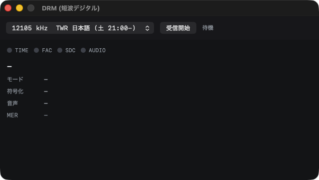

# Deck RX Solo — the standalone receiver

The whole receiver in one bundle. No Stream Deck, no plugin, no Node.

Part of [deck-rx](../README.md).


## Using it

1. Type the SpyServer's address and port, and press **DIRECT**.
2. Press **AUDIO**.
3. Pick a station from the list on the left — or type a frequency into the
   readout, or walk with **TUNE −/+**.

That is all of it. The rest, briefly:

| | |
| --- | --- |
| **PRESET ◀ ▶** | step through the list on the left |
| **TUNE − +** | one step, and the step follows the mode: 9 kHz on AM, 100 kHz on FM |
| **WFM … CW** | the mode. Bandwidth and the options panel follow it |
| **BAND JUMP** | MW, the shortwave metre bands, FM |
| **STEP / FFT / RATE / SMOOTH** | the spectrum: resolution, frame rate, how much it is averaged |
| **HOLD** | freezes the trace; the waterfall keeps running |
| **NR / LVL** | noise reduction, and the output leveller |
| **IMPORT** | pulls SDR++'s bookmarks into the preset list |
| **ZOOM / MAX / MIN / TIME** (right edge) | span, the dB window top and bottom, and how much history the waterfall holds |
| **POWER** | disconnects and stops the audio |

Drag on the spectrum to tune; the station name of whatever the marker is over
appears above it. The picture is drawn where the ear is rather than where the
samples are, so what is seen and what is heard line up.

Settings live in `~/Library/Application Support/deck-rx/receiver.json` and are
written as they change — there is no Save.

## Weather fax and DRM

Both are in the **ツール** menu and take a copy of the same IQ the receiver is
already pulling, so neither interrupts listening.

**気象ファクス** (Cmd-F) records the current frequency for two, five or twelve
minutes and draws the chart — twelve is one JMH chart at 120 LPM. Recording
first and drawing after, because the line period is found by measuring the whole
page: the nominal 3000 samples is never exactly right, and an error of one part
in three thousand shears the chart across a third of its width.

**DRM** (Cmd-D) decodes Digital Radio Mondiale on shortwave: sync lamps, station
name, coding, bit rate and the running text, with the audio going to the same
output the receiver uses. Costs 8-9 % of one core.



The four lamps are the diagnosis, in order: TIME means the OFDM timing was found
— that happens on noise too — FAC means a frame was decoded, which cannot happen
by accident, SDC brings the station name with it, and AUDIO is the AAC decoder
accepting frames.

The decoder is not in this repository. **Run
[`native-app/drm/fetch.sh`](../native-app/drm/) once** to enable it; a checkout
that never does still builds, without the menu item. That directory's README
covers the licence, which is short: the decoder is GPL and so is this, so there
is nothing to reconcile, but fdk-aac's licence means **a binary built with DRM
must not be passed on**. Publishing source and running it yourself are
unaffected.

No DRM transmission has been received off the air here yet; the decode is proven
on recordings.

## Copying it to another Mac

Nothing has to be installed with it — no plugin, no Node, no native modules.

```sh
cp -R "/Applications/Deck RX Solo.app" /Volumes/somewhere/
# on the other machine, after copying:
xattr -dr com.apple.quarantine "/Applications/Deck RX Solo.app"
```

That last line is needed for a build signed here rather than one from a
[release](https://github.com/soresore19xx/deck-rx/releases/latest); see
[Handing it to someone else](#handing-it-to-someone-else) below.

`autoDirect` and `autoAudio` in the config do the two opening presses at
launch, which is the only way to drive it on a machine nobody sits at.

The menu bar is built by hand — there is no nib — so About and Quit exist at
all. About reports which of the two builds is running and what it is pointed
at, which is a real question with both installed.

### Handing it to someone else

The `xattr` line above is not a formality: `build-app.sh` signs with whatever
identity is in the keychain, and on a development machine that is an **Apple
Development** certificate. Gatekeeper rejects those on any Mac that did not
build them (`spctl -a -vv` says `rejected`), so a recipient meets "the developer
cannot be verified" and has to strip the quarantine flag by hand. That is fine
between one's own machines and poor manners towards anyone else.

`notarize.sh` is the other half, for a build that is actually going somewhere:

```sh
./notarize.sh                       # defaults to /Applications/Deck RX Solo.app
./notarize.sh "/path/to/Some.app" my-profile
```

It works on a copy — `/Applications` is never touched — re-signs with
**Developer ID** plus the hardened runtime and a secure timestamp, submits to
Apple, staples the ticket, and shows what Gatekeeper makes of the result. It
submits a zip and never a .dmg: notarytool mounts a disk image to look inside
it, and a mount that sticks leaves the tool waiting forever with nothing in
Apple's history to show for it.

Two things have to exist first, and it says so plainly if they do not:

- a **Developer ID Application** certificate (Account Holder, paid membership).
  Apple Development cannot be notarised. Look on the other machines before
  making one: a team may hold five and **a Developer ID certificate cannot be
  revoked**, so a wasted slot stays wasted. Make it through developer.apple.com
  rather than Xcode's Manage Certificates, which issues off the old G1
  intermediate and produces a leaf that expires when G1 does (2027-02-01)
  however new the certificate is — upload a CSR and pick the "G2 Sub-CA
  (Xcode 11.4.1 or later)" sub-CA explicitly.
- notarytool credentials, either stored in the keychain
  (`xcrun notarytool store-credentials <profile> --key AuthKey_X.p8 --key-id X --issuer <uuid>`)
  or passed in as `NOTARY_KEY` / `NOTARY_KEY_ID` / `NOTARY_ISSUER`, which is
  what works over ssh where a keychain profile cannot be read. An App Store
  Connect team API key rather than an app-specific password: it does not expire
  and no password lands in a script or a shell history.

**Signing has to happen in the desktop session.** Over ssh `codesign` cannot
reach the login keychain and fails with `errSecInternalComponent`, whichever
machine holds the certificate; the script says so when it happens. An ssh caller
can still start it there without a password — `open -a Terminal <wrapper>.command`
runs in the logged-in session.

It also does two things on its own initiative, both deliberate:

- **It refuses a bundle with the DRM decoder in it.** fdk-aac's licence does not
  combine with the GPL in a binary that is passed on, and this is the one place
  that rule can be enforced rather than remembered. Keep the DRM build for
  yourself — that was always allowed.
- **It drops the bundled `presets.json`.** Shipping one machine's station list
  is right for a second Mac of the same owner and wrong for a stranger, who
  should start empty rather than with someone else's listening.

One thing it cannot soften: a Developer ID signature carries the certificate
holder's name, which for an individual membership is a real one. `codesign -dvv`
on the result shows it, and so does the recipient's Gatekeeper dialogue. That is
how the mechanism works — worth deciding on before publishing a build rather
than after.

## Settings

`~/Library/Application Support/deck-rx/receiver.json`, seeded from the plugin's
`config.json` on a first run when there is one and never written back to it.
Host and port are editable from the options panel, so a copied app needs no
hand-edited file. The station databases ship inside the bundle and seed
`~/Library/Application Support/deck-rx/data` on first launch.

`spectrumSplit` is the fraction of the spectrum panel given to the trace,
dragged on the rail rather than typed.

`spectrumFftSize`, `spectrumFps` and `spectrumSmooth` are the transform itself
— how big, how often, and how much frame-to-frame averaging (a divisor: 1 is
off, larger is slower). The Mac's toolbar has written all three since it had
one; they simply had nowhere to live, so every launch started at the defaults
again. The framerate now also restarts the frame timer when it changes: the
period is read when the timer is scheduled, so the RATE dropdown did nothing
until the next connection. The iPad's options sheet carries the two that get
ridden, framerate and smoothing.

`uiScale` picks `min`, `middle` or `max` — fonts and every fixed dimension
scale together, since scaling only the text leaves the panels their full width.
The frequency readout and the station line above it take a further reduction on
top of that: they are the largest things on screen by a wide margin. Applied
immediately; the window is rebuilt in place and the receiver keeps running,
though the waterfall's history restarts because its bitmap is sized to the old
panel.

Both bundles read and write it, and neither sends it over the control endpoint:
the scale is the window's own size, and the endpoint on `:8771` may well belong
to the plugin, which has no opinion about it. It used to be asked for over that
link, so the row read `—` and its click came back 400 — in the front-end always,
and in the standalone app whenever the plugin held the port.

| scale | minimum window |
| --- | --- |
| max | 1435 × 784 |
| middle | 1278 × 681 |
| min | 1139 × 620 |

An 11-inch MacBook Air is 1366 × 768, so `compact` is what fits it.

## Sharing the receiver

SpyServer takes several clients at once and gives control to the first only. A
later client's retune is discarded silently, so the app reports it: `canControl`
in `/health`, **LISTEN ONLY** in the window, 409 from `/tune`, and the readout
follows the device rather than claiming a frequency nothing is receiving. There
is no arbitration — which client owns the radio is the user's call.

## CPU

Measured on a 2015 MacBook Air 11 (two Broadwell cores):

| setting | CPU |
| --- | --- |
| FFT 4096, 30 fps, IQ 456 kHz | 79% |
| FFT 1024, 10 fps, IQ 456 kHz | 84% |
| FFT 1024, 10 fps, IQ 228 kHz | 44% |

FFT size and frame rate do essentially nothing: demodulation runs per IQ sample
and a transform thirty times a second is noise beside it. Only the IQ rate
matters, and halving it costs FM quality — the plugin raised its own default
from 228 to 456 kHz because far-adjacent stations aliased into the audible
baseband. AM does not care, so `iqDecimation: 2` is a real option on a slow
machine used for medium wave and not on one used for FM.


## Under it

Why this exists at all, how the display is kept in step with the ear, and
what tuning inside the window has to get right are in
[standalone-app-port.md](standalone-app-port.md#deck-rx-solo-design-notes).
